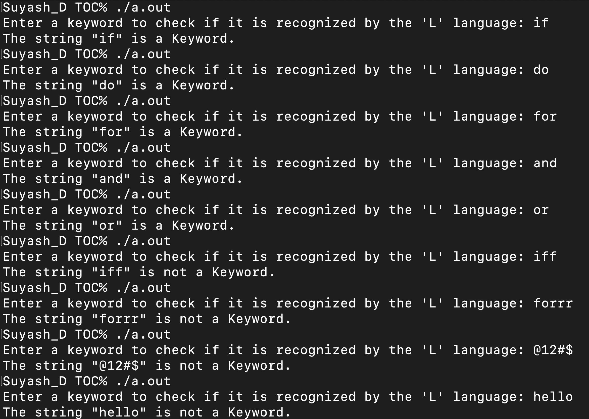
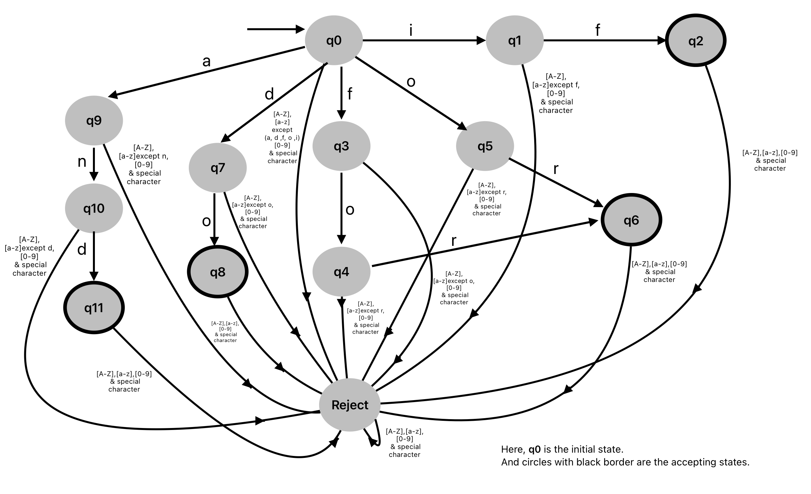

<h1>DFA: Keyword Recognizer</h1>

This repository contains a C program that simulates a Deterministic Finite Automaton (DFA) designed to recognize keywords in the hypothetical language L. It serves as a demonstration of DFA implementation in C for lexical analysis.

L Language Overview

In this project, I've simulated a DFA using a C program to recognize keywords in the <b>hypothetical language L</b>. While L isn't an actual programming language, I've chosen it for its simplicity and case sensitivity, making it ideal for DFA implementation. This approach allows us to focus on the DFA logic without the complexity of a real programming language like C, which has 32 keywords.
Assuming L to have five keywords (if, do, for, and, or), this program efficiently identifies these keywords within input strings.

<h1>Technologies Used</h1>
<li><ul>C Programming Language</ul>
</li>

<h1>Preview</h1>
 
<h3>Output:</h3>

 
<h3>Transition Diagram:</h3>

<h1>Usage Instructions</h1>

To run the DFA keyword recognizer:

* Clone this repository to your local machine using git clone https://github.com/Suyash-Dhakal/Deterministic-Finite-Automaton-TOC.git
* Compile and Run the C program.
* Follow the prompts to input a string and observe the DFA's recognition of keywords.

Feel free to explore and provide feedback!